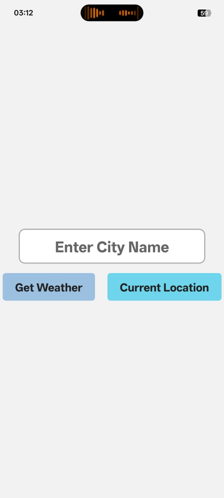
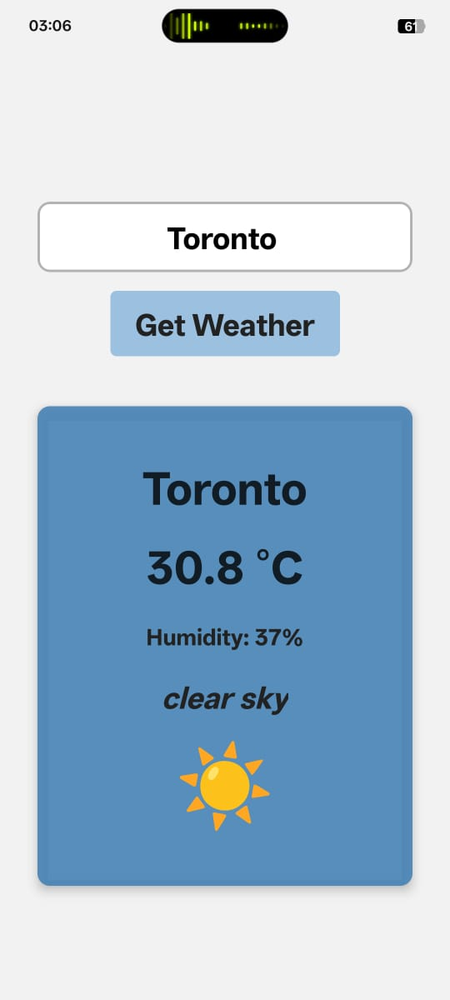
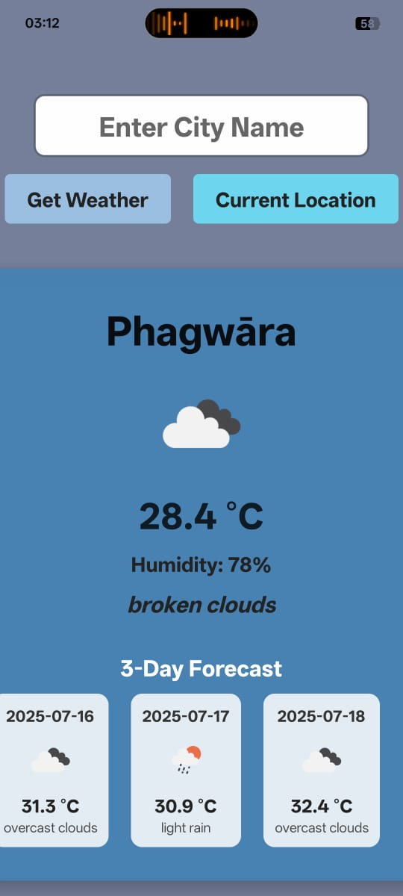

# Weather Forecast App

A beautiful, modern weather app built with React Native and Expo. Get the current weather and a 3-day forecast for any city or your current location, with dynamic backgrounds and official weather icons.

---

## 🌟 Features
- **Current Weather** for any city
- **3-Day Forecast** (powered by OpenWeatherMap)
- **Weather for Your Location** (uses device GPS)
- **Official Weather Icons** from OpenWeatherMap
- **Dynamic Background Gradient** based on weather
- **Loading Animation** while fetching data
- **Polished Card UI** with shadows and rounded corners
- **Error Handling** for invalid city/location

---

## 📱 Screenshots

| Home Screen | Weather Result | 3-Day Forecast |
|:-----------:|:--------------:|:--------------:|
|  |  |  |


---

## 🚀 Getting Started

1. **Install dependencies:**
   ```sh
   npm install
   ```
2. **Install Expo CLI (if not already):**
   ```sh
   npm install -g expo-cli
   ```
3. **Start the app:**
   ```sh
   npx expo start
   ```
4. **Run on your device:**
   - Use the Expo Go app (Android/iOS) or an emulator/simulator.

---

## 🛠️ Tech Stack
- React Native
- Expo
- OpenWeatherMap API

---

## 🙏 Credits
- [OpenWeatherMap](https://openweathermap.org/) for weather data and icons
- [Expo](https://expo.dev/) for the development platform

---

## 📄 License
This project is for learning and demo purposes. 